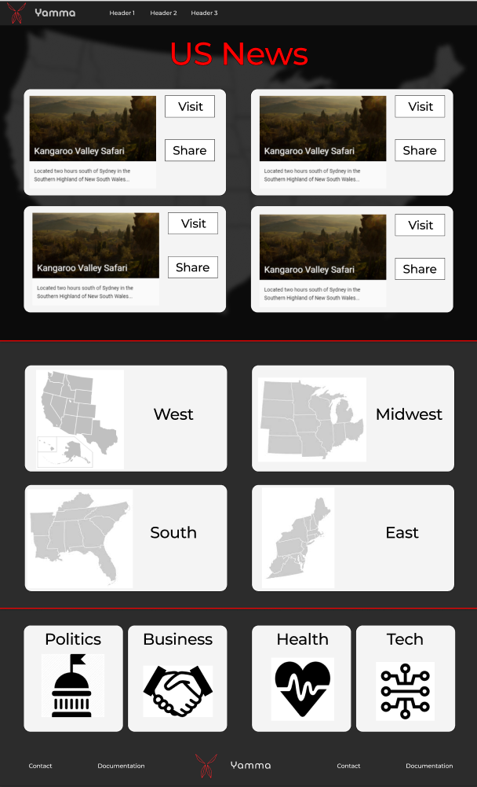
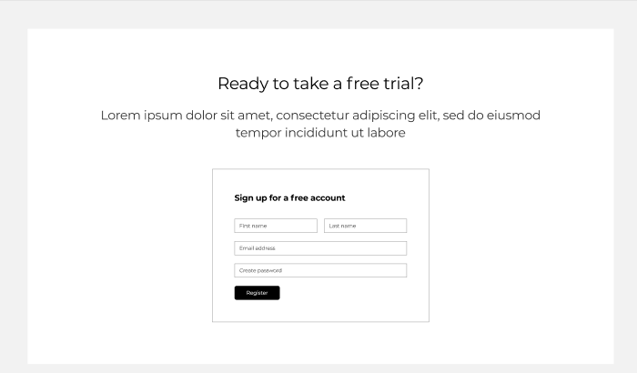
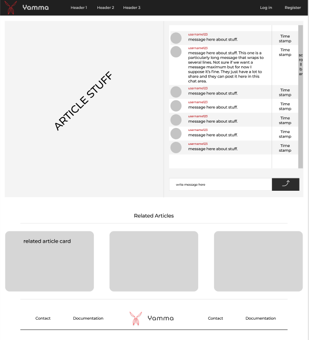
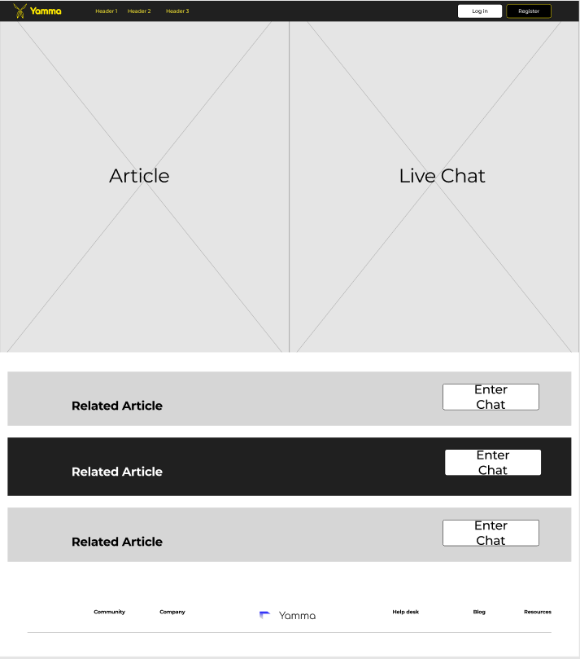
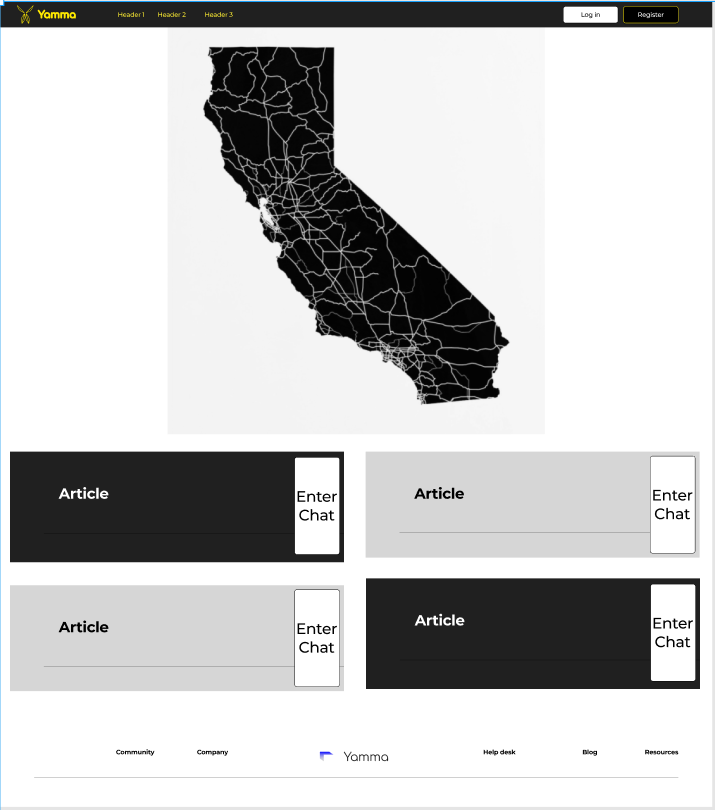
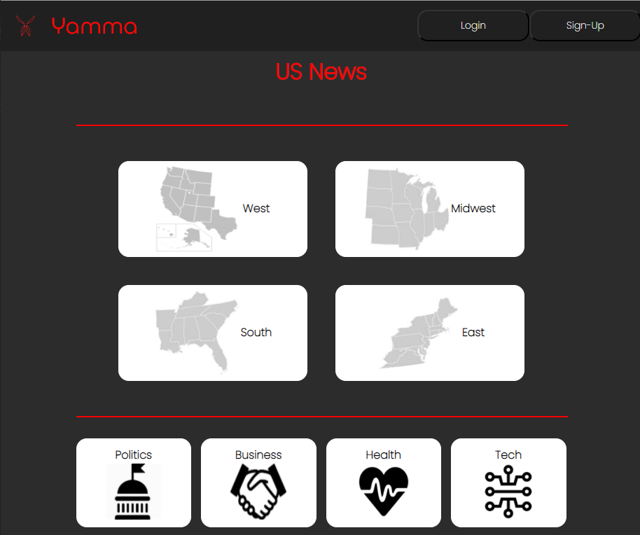
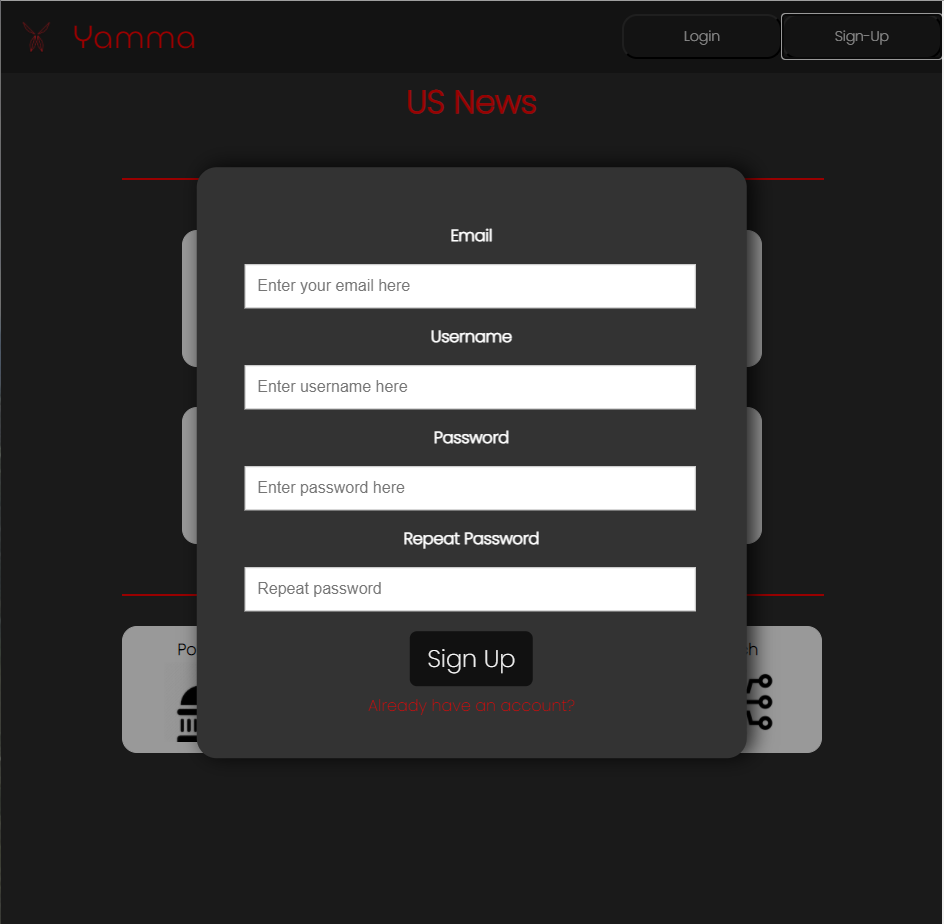
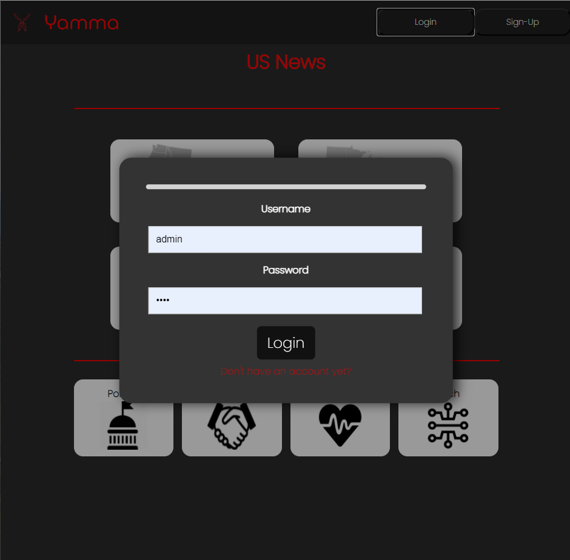
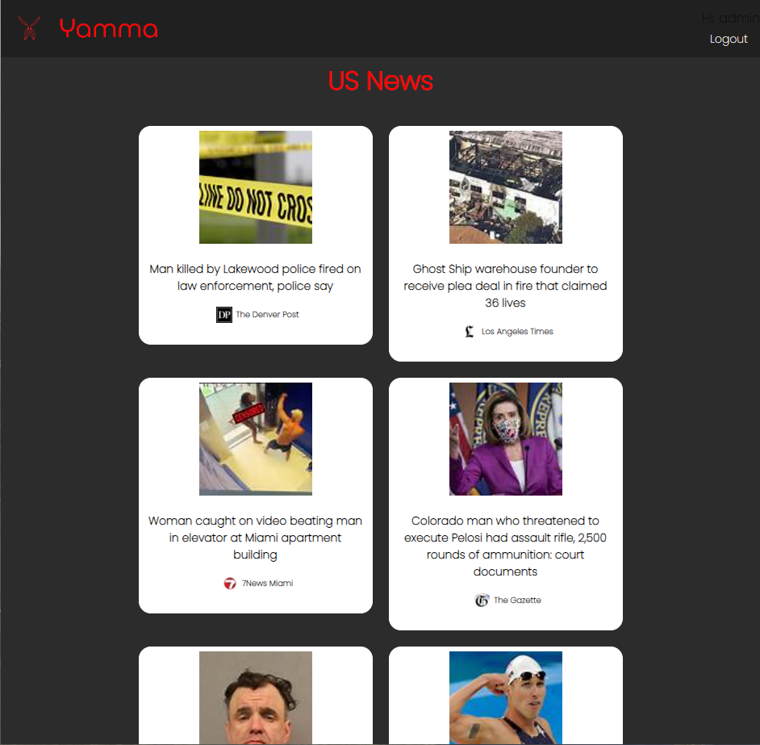
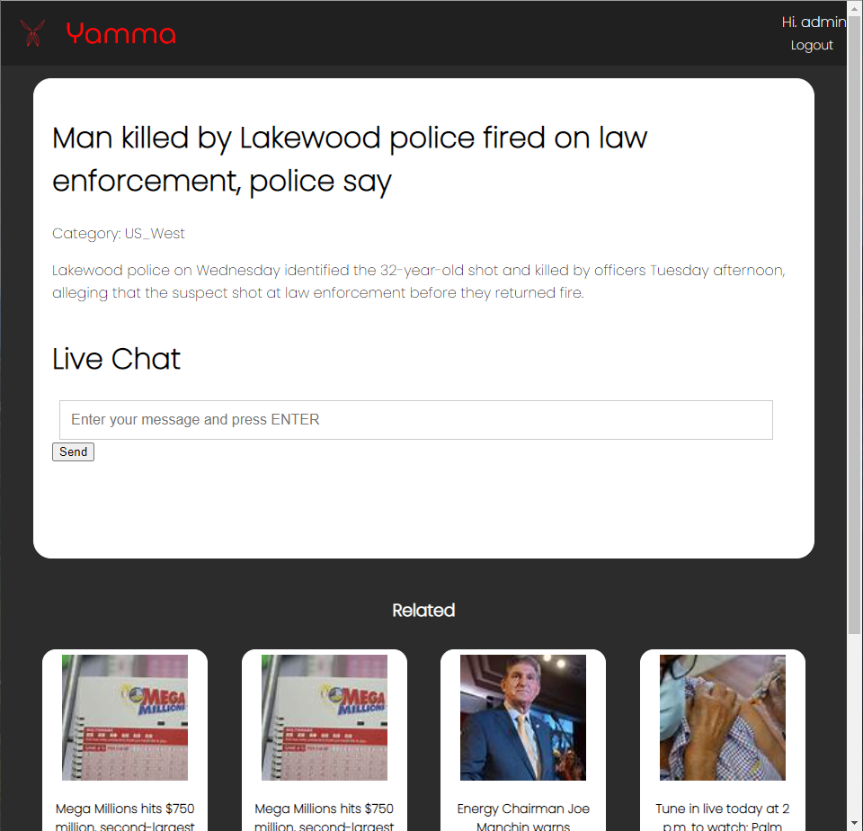

# Yamma

Yamma provides users with a compilation of up-to-date U.S. news. Users can communicate with each other through corresponding article chat windows.

### 1. Working Prototype

You can access a working prototype of the React app here: https://yamma-client.vercel.app/ and Node app here: https://yamma-server.herokuapp.com/

### 2. User Stories

###### (Importance - High)

- As a physically impared user
- All ‘High’ importance functions can be done without requiring the use of a mouse/trackpad
- So I can still use this app

###### (Importance - High)

- As a visually impared user
- I want to be able to do all ‘High’ importance functions
- So I can still use this app

###### Landing Page (Importance - High)

- As a visitor
- I want to understand what I can do with this app (or sign up, or log in
- So I can decide if I want to use it

###### Landing Page (Importance - Medium)

- As a visitor
- I want to see different current live events
- So I can decide if I like this service

###### Dashboard Page (Importance - High)

- As a logged in user
- I want to be able to log out of my account
- So my account is not accessible to others

###### Dashboard Page (Importance - High)

- As a logged in user
- I want to be able to see live-updated event list
- So I can see recent events

###### Dashboard Page (Importance - High)

- As a logged in user
- I want to be able to navigate to an event’s chat
- So I can read the chat

###### Dashboard Page (importance - Medium)

- As a logged in user
- I want to be able to navigate to the original article source
- So I can read the original article

###### Dashboard Page (Importance - Medium)

- As a logged in user
- I want to be able to filter event feed
- So I can see events I am more interested in

###### Event Page (Importance - High)

- As a logged in user
- I want to see information about the event (start with just article link||title)
- So I can know what the page is about

###### Event Page (Importance - High)

- As a logged in user
- I want to see comments made about an event
- So I can see other’s comments

###### Event Page (Importance - High)

- As a logged in user
- I want to be able to post a comment on an event
- So my thoughts can be seen by others

######Event Page (Importance - Medium) - websockets (socket.io, firebase (real-time db))

- As a logged in user
- I want to interact with a live comment section for an event
- So I can interact with comments in real-time

### 3. Functionality

The app's functionality includes:

- Every User has the ability to create an account
- Registered Users have the ability to log in
- Registered Users have the ability to create chat posts
- Registered Users have the ability to view live chat windows
- Registered Users have the ability to view chat posts from other users

### 4. Technology

- Front-End: HTML5, CSS3, JavaScript, ES6, React
- Back-End: Node.js, Express.js, Mocha, Chai, RESTful API Endpoints, Postgres
- Development Environment: Heroku, DBeaver

### 5. Wireframes

Landing Page
:-------------------------:

Register Page
:-------------------------:

ChatPage
:-------------------------:

ArticlePage
:-------------------------:

### 6. Front-end Structure - React Components Map

- **Index.js**
  - **App.js** (stateful)
    - **FilterRoute** (context-provider)
      - **DashboardRoute.js** (stateful)
        - **Map.js** (stateless)
        - **EventList.js** (stateful) (no context)- connect to events table
          - **EventCard.js** (stateless)
        - **Sidebar.js** (stateful)
      - **EventPageRoute.js** (stateful)
        - **ArticlePanel.js**(stateful)
        - **ChatPanel.js** (stateful) - connect to comments table [event_id]
          - **ChatFeed.js** (stateful)
          - **ChatForm.js** (stateful) - connect to comments table
        - **RelatedArticleList.js**(stateful)
          - **RelatedArticleCard.js**(stateful)
      - **LoginRoute.js** (stateful)
        - **LoginForm.js** (stateful) - connect to users table [username, password]
      - **RegisterRoute.js**(stateful)
        - **RegisterForm.js** (stateful) - connect to users table [username, email, password]
    - **Header.js** (stateless)
      - **Navbar.js**(stateful)
    - **Footer.js** (stateless)

### 7. Back-end Structure - Business Objects

### 8. API Documentation

## [OpenAPI Docs](https://app.swaggerhub.com/apis/s-poveda/Yamma-API/1.0.0)

### 9. Screenshots

Landing Page
:-------------------------:

Register Page
:-------------------------:

Login Page
:-------------------------:

Articles Page
:-------------------------:

Article Chat Page
:-------------------------:

### 10. Development Roadmap

This is v1.0 of the app, but future enhancements are expected to include:

- add more functionality

### 11. How to run it

Use command line to navigate into the project folder and run the following in terminal

##### Local React scripts

- To install the react project ===> npm install
- To run react (on port 3000) ===> npm start
- To run tests ===> npm run test

##### Local Node scripts

- To install the node project ===> npm install
- To migrate the database ===> npm run migrate -- 1
- To run Node server (on port 8000) ===> npm run dev
- To run tests ===> npm run test
